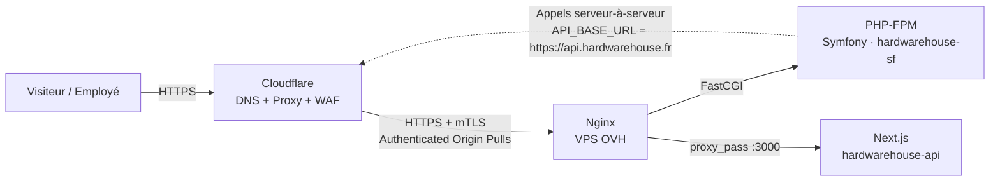

# Infrastructure de déploiement — HardwareHouse

Ce document décrit l'infrastructure réseau mise en place pour la production de `hardwarehouse.fr` : migration DNS vers Cloudflare, verrouillage de l'origine, et pare-feu réseau. Il complète [DEPLOYMENT.md](DEPLOYMENT.md), qui couvre le pipeline CI/CD et la configuration serveur de base (PHP-FPM, Nginx, Certbot).

> **Note sur ce document** : les adresses IP, noms d'hôte et identifiants système présents ici sont volontairement remplacés par des valeurs génériques (le dépôt étant public). Le nom de domaine `hardwarehouse.fr` reste inchangé car il est déjà public (site en ligne, dépôt GitHub).

## 1. Vue d'ensemble

Deux applications sont hébergées sur le même VPS OVH, distinguées par nom de domaine au niveau de Nginx :

- **`hardwarehouse.fr`** — vitrine e-commerce Symfony (ce dépôt), servie via PHP-FPM (FastCGI)
- **`api.hardwarehouse.fr`** — API + panel d'administration Next.js (`hardwarehouse-api`), servie via reverse proxy vers un processus Node.js local (port 3000)



Point notable : le storefront Symfony consomme l'API via son nom de domaine public (`API_BASE_URL`), pas en local. Ces appels **ressortent donc réellement vers Cloudflare** avant de revenir sur le VPS (routage en épingle à cheveux / *hairpin*) — ce détail a des implications directes sur la configuration WAF (voir ##7).

## 2. Pourquoi Cloudflare ?

- **Protection DDoS** en périphérie, avant que le trafic n'atteigne le VPS
- **Masquage de l'IP d'origine** — un attaquant qui connaît le domaine ne peut pas cibler directement le serveur
- **CDN** pour les assets statiques
- **DNSSEC, SSL géré**, et une base de protection applicative (WAF basique, Bot Fight Mode) même en plan gratuit

## 3. Migration DNS

1. Création de la zone sur Cloudflare, import automatique des enregistrements existants (A, MX, TXT)
2. Changement des serveurs DNS chez le registrar (OVH) : passage des NS OVH vers les deux NS assignés par Cloudflare (option "Utiliser mes propres DNS")
3. **Désactivation du DNSSEC côté registrar avant la bascule** — un DS record encore publié pointant vers l'ancien signataire alors que l'autorité DNS a changé peut rendre le domaine intermittemment injoignable
4. Vérification de propagation :
   ```bash
   dig @1.1.1.1 hardwarehouse.fr NS +short   # doit renvoyer les NS Cloudflare
   dig hardwarehouse.fr DS +short             # doit être vide (DNSSEC retiré)
   ```

Point d'attention identifié : un enregistrement `CNAME` pour un sous-domaine `ftp` était proxifié par défaut lors de l'import automatique — à repasser impérativement en **DNS only** (nuage gris), le proxy Cloudflare ne relayant que du trafic HTTP(S)/WebSocket, pas du FTP.

## 4. SSL/TLS : mode Full (strict)

Trois modes existent côté Cloudflare : *Flexible* (HTTP en clair jusqu'à l'origine — à proscrire), *Full* (HTTPS jusqu'à l'origine mais certificat non vérifié), et **Full (strict)** (HTTPS + certificat d'origine validé). Le VPS disposant déjà d'un certificat Let's Encrypt valide (Certbot, voir DEPLOYMENT.md), *Full (strict)* a été retenu : chiffrement de bout en bout, aucune dégradation de sécurité en cours de route.

## 5. Restitution de l'IP réelle du visiteur (`real_ip`)

Sans configuration spécifique, Nginx voit l'IP de Cloudflare comme IP source de toutes les requêtes (puisque Cloudflare fait office de proxy). Le module `real_ip` réécrit `$remote_addr` avec la véritable IP du visiteur, transmise par Cloudflare dans l'en-tête `CF-Connecting-IP`.

`/etc/nginx/conf.d/cloudflare.conf` :
```nginx
# Plages IPv4 Cloudflare (cloudflare.com/ips) — publiques, à revalider périodiquement
set_real_ip_from 173.245.48.0/20;
set_real_ip_from 103.21.244.0/22;
set_real_ip_from 103.22.200.0/22;
set_real_ip_from 103.31.4.0/22;
set_real_ip_from 141.101.64.0/18;
set_real_ip_from 108.162.192.0/18;
set_real_ip_from 190.93.240.0/20;
set_real_ip_from 188.114.96.0/20;
set_real_ip_from 197.234.240.0/22;
set_real_ip_from 198.41.128.0/17;
set_real_ip_from 162.158.0.0/15;
set_real_ip_from 104.16.0.0/13;
set_real_ip_from 104.24.0.0/14;
set_real_ip_from 172.64.0.0/13;
set_real_ip_from 131.0.72.0/22;

# Plages IPv6 Cloudflare
set_real_ip_from 2400:cb00::/32;
set_real_ip_from 2606:4700::/32;
set_real_ip_from 2803:f800::/32;
set_real_ip_from 2405:b500::/32;
set_real_ip_from 2405:8100::/32;
set_real_ip_from 2a06:98c0::/29;
set_real_ip_from 2c0f:f248::/32;

real_ip_header CF-Connecting-IP;
```

Cette IP réelle est ensuite ce que voit l'application Symfony (utile pour le rate limiting applicatif, voir le code de `RateLimiterService`).

## 6. Verrouillage de l'origine : Authenticated Origin Pulls

### Le problème

Tant que l'IP publique du VPS est connue, rien n'empêche de la requêter **directement**, en contournant intégralement Cloudflare (donc son WAF, son anti-DDoS, son cache).

### Approche écartée : allowlist d'IP sur le pare-feu réseau OVH

L'option naturelle — n'autoriser sur les ports 80/443 que les plages IP de Cloudflare au niveau du pare-feu réseau OVH — s'est révélée impraticable : **le pare-feu Edge Network d'OVH limite à 20 règles par IP protégée**, alors que Cloudflare publie 15 plages IPv4 + 7 IPv6 (22 plages), sans compter les règles nécessaires pour SSH et une règle de refus finale obligatoire.

### Solution retenue : Authenticated Origin Pulls (mTLS)

Mécanisme Cloudflare gratuit, indépendant de toute plage IP : chaque connexion de Cloudflare vers l'origine présente un certificat client TLS que seul Cloudflare possède. Nginx exige ce certificat pour établir la connexion — toute tentative directe échoue au moment du handshake TLS, avant même d'atteindre l'application.

**Côté Cloudflare** : `SSL/TLS → Origin Server` → activer *Authenticated Origin Pulls*.

**Côté Nginx** (dans chaque bloc `server { listen 443 ssl; ... }` proxifié par Cloudflare — `hardwarehouse.fr` et `api.hardwarehouse.fr`) :
```nginx
ssl_client_certificate /etc/nginx/ssl/authenticated_origin_pull_ca.pem;
ssl_verify_client on;
```

Vérification :
```bash
# Échoue (handshake refusé) — preuve que le verrou fonctionne
curl -k https://<IP_ORIGINE> -H "Host: hardwarehouse.fr"
# → 400 No required SSL certificate was sent

# Fonctionne normalement, via Cloudflare
curl -sI https://hardwarehouse.fr
```

Grâce à ce mécanisme, le firewall réseau (§7) n'a plus besoin de filtrer 80/443 par IP — il se concentre sur le SSH et ferme le reste par défaut.

## 7. Pare-feu réseau (OVH Edge Network Firewall)

Filtrage en périphérie du réseau OVH, avant que le trafic n'atteigne le VPS. Fonctionne par règles priorisées (0 = évaluée en premier), la chaîne s'arrêtant à la première règle qui correspond. **Une règle de refus explicite est obligatoire** — un jeu de règles ne contenant que des autorisations n'est pas filtrant du tout.

| Priorité | Action | Protocole | Port | Rôle |
|---|---|---|---|---|
| 0 | Autoriser | TCP | — (état `established`) | Trafic retour des connexions déjà établies |
| 1 | Autoriser | TCP | 22 | SSH |
| 2 | Autoriser | TCP | 443 | HTTPS |
| 3 | Autoriser | TCP | 80 | HTTP (redirection vers HTTPS) |
| 4 | Autoriser | ICMP | — | Ping / diagnostic réseau |
| 5 | Autoriser | UDP | 53 (port source) | Réponses des résolutions DNS effectuées par le serveur |
| 17 | Refuser | ICMP | — | Reste du trafic ICMP |
| 18 | Refuser | UDP | — | Reste du trafic UDP |
| 19 | Refuser | TCP | — | Reste du trafic TCP |

Point de vigilance appliqué pendant la mise en place : la règle 5 (DNS) doit restreindre le **port source** à 53 — une règle "autoriser tout UDP" sans restriction rendrait inutile la règle de refus UDP qui la suit (elle ne serait jamais atteinte, la chaîne s'arrêtant à la première correspondance).

Méthode de sécurisation suivie pour éviter un verrouillage accidentel de l'accès SSH : configuration de toutes les règles pendant que le pare-feu restait désactivé, activation seulement après relecture complète du jeu de règles, test de reconnexion SSH dans un terminal séparé **avant** de fermer la session existante.

## 8. Règle Cloudflare : autoriser le trafic de l'origine elle-même

Conséquence directe du schéma en §1 : les appels serveur-à-serveur de Symfony vers `api.hardwarehouse.fr` traversent Cloudflare comme n'importe quelle requête publique. Sans exception, les protections anti-bot de Cloudflare (Bot Fight Mode, Browser Integrity Check — qui inspecte des en-têtes typiques d'un navigateur, absents d'un client HTTP serveur-à-serveur) pourraient bloquer ce trafic légitime, cassant le site entier de façon difficile à diagnostiquer.

**Security → Security rules → Custom rules** :
- Expression : `(ip.src eq <IP_ORIGINE>)`
- Action : `Skip`, avec tous les composants de sécurité cochés (règles personnalisées restantes, rate limiting, règles managées, Bot Fight Mode, Browser Integrity Check, etc.)

## 9. Synthèse des couches de protection

| Couche | Protège contre | Mécanisme |
|---|---|---|
| DNS Cloudflare | Résolution directe de l'origine | Domaine résolu vers les IP Cloudflare, pas celle du VPS |
| WAF / Bot Fight Mode | Requêtes automatisées malveillantes | Cloudflare (plan gratuit : couverture de base) |
| Authenticated Origin Pulls | Contournement de Cloudflare par accès direct à l'IP | mTLS entre Cloudflare et Nginx |
| Pare-feu réseau OVH | Accès aux ports/services non exposés publiquement | Allowlist par port, refus par défaut |
| `real_ip` Nginx | Logs/rate limiting basés sur la mauvaise IP | Restitution de l'IP réelle depuis `CF-Connecting-IP` |

## 10. Limites connues et pistes d'amélioration

- **Plan Cloudflare gratuit** : pas de WAF managé (ruleset OWASP nécessite Pro), quota limité à 5 règles personnalisées et 1 règle de rate limiting
- **Plages IP Cloudflare non auto-actualisées** — la liste utilisée en §5 est figée à la date de mise en place ; à revalider périodiquement sur [cloudflare.com/ips](https://www.cloudflare.com/ips/)
- **`api.hardwarehouse.fr` sert un double usage** (appels serveur-à-serveur + accès direct du panel admin par les employés) — une séparation en deux sous-domaines distincts permettrait de placer **Cloudflare Access** (authentification SSO en périphérie, gratuit jusqu'à 50 utilisateurs) devant le seul panel d'administration, sans impacter les appels API internes
- **IPv4 uniquement** pour l'origine documentée ici — à étendre si le VPS expose aussi une IPv6 publique

## 11. Références

- [OVHcloud — Edge Network Firewall](https://docs.ovhcloud.com/en/guides/bare-metal-cloud/dedicated-servers/firewall-network)
- [Cloudflare — Authenticated Origin Pulls](https://developers.cloudflare.com/ssl/origin-configuration/authenticated-origin-pull/set-up/global/)
- [Cloudflare — Plages IP publiées](https://www.cloudflare.com/ips/)
- [DEPLOYMENT.md](DEPLOYMENT.md) — pipeline CI/CD et configuration serveur de base
